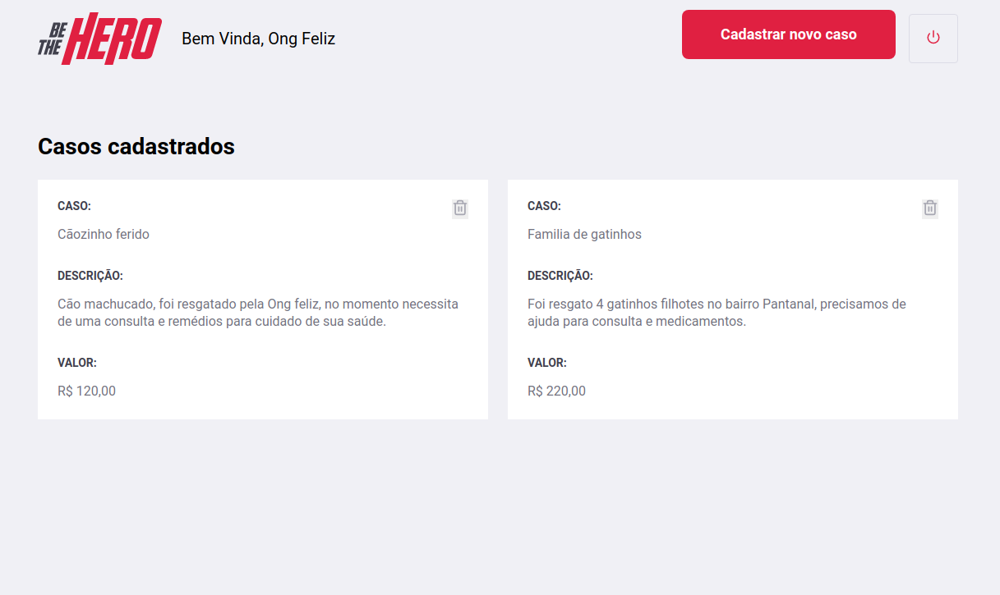

<h1 align="center">
    
</h1>

<h1 align="center">
    
</h1>

<h1 align="center">
    
     
</h1>


<h4 align="center">
  🚀 Semana OmniStack 11.0
</h4>

<br>

## :rocket: Tecnologias

Esse projeto foi desenvolvido com as seguintes tecnologias:

- [Node.js](https://nodejs.org/en/)
- [React](https://reactjs.org)
- [React Native](https://facebook.github.io/react-native/)
- [Expo](https://expo.io/)

## 💻 Projeto

O Be The Hero é um projeto que facilita a vida dos heróis em salvar o dia, tornando possível o usuário visualizar casos publicados por ONGs e entrar em contato com elas via E-mail ou WhatsApp, ou no caso de uma ONG, se cadastrar e encontrar um herói.


## 🔖 Como Executar

#### Clonando o projeto
```sh
git clone https://github.com/wesleyberger/Omnistack.git
cd semana-omnistack-11
npm install
```
#### Iniciando Backend
```sh
cd backend
npm start
```
#### Iniciando Frontend
```sh
cd frontend
npm start
```
#### Iniciando mobile
```sh
cd mobile
npm start
```

<p align="center">
  
</p>
